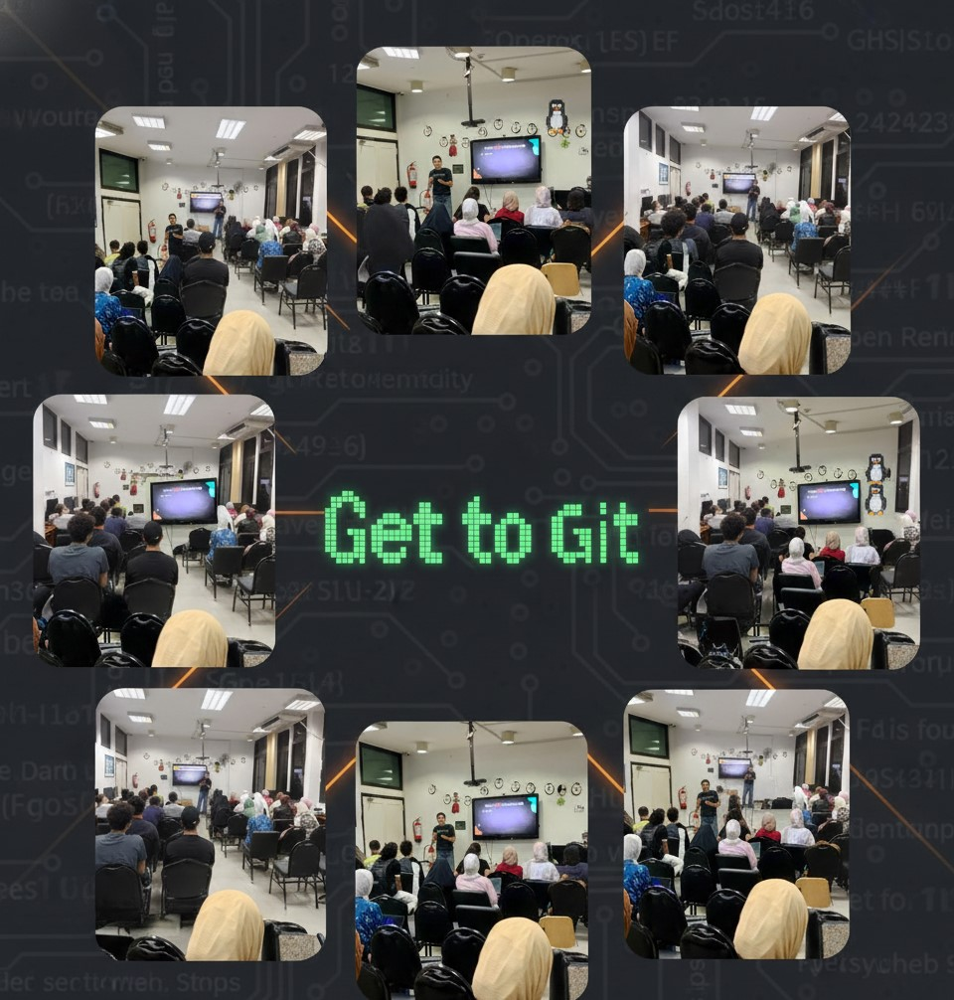

# Get-To-Git
**It is easy to shoot your foot off with Git, but also easy to revert to a previous foot and merge it with your current leg."** — Jack William Bell

## This Repo explore:
- Git and introduction to use it. 
- How to Contribute in open source projects.

- **Check Slides:**

## Contents:
- [Git basic commands](Git.md)
- [session1](./session-1/Get%20to%20Git%20-%20Session%201%20-%20Akayiz.pdf)
- [session2](Session%202)
--------

## Get-To-Git Playlist:
- **Basics:**  [Get to git](https://youtube.com/playlist?list=PLanhLNyaKYBn7H4ekD2aOAimlSiNJaeh8&si=es_KGS8lLbWFUq2p)
- **Advanced:**  [Advance with git](https://youtube.com/playlist?list=PLanhLNyaKYBmt4a0XiLkWWz4eMYlOViwq&si=4oklyel0UTCY5JMO)
